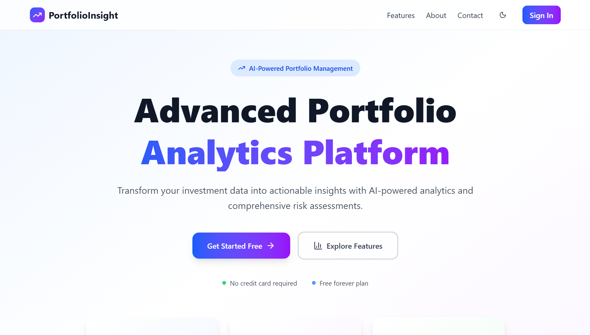
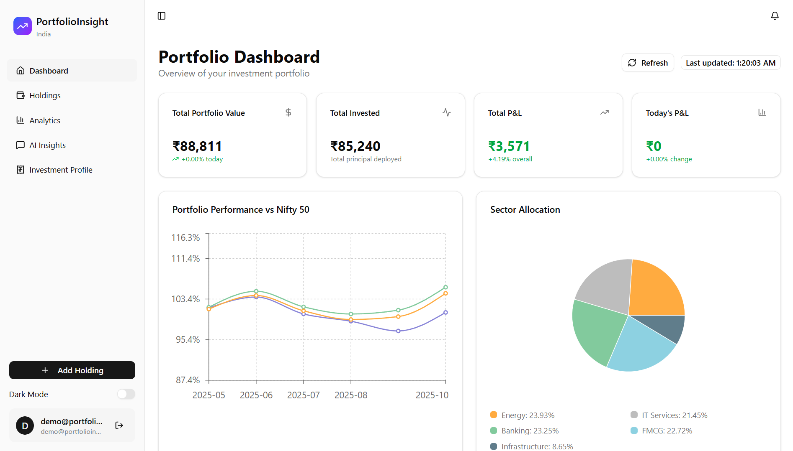
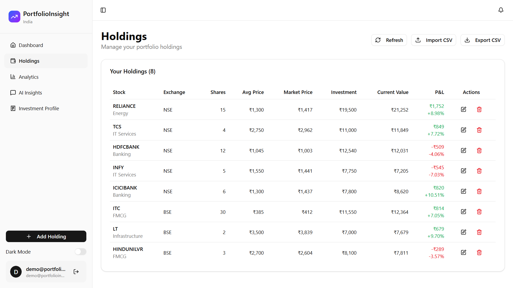
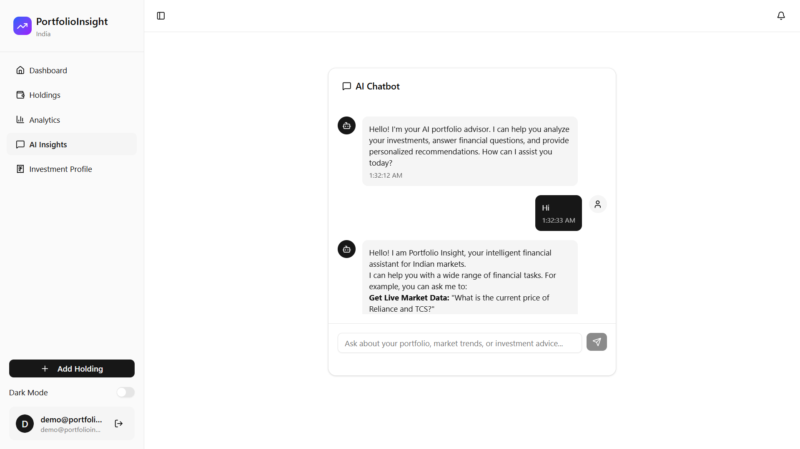

# PortfolioInsight: AI-Powered Portfolio Analytics for Indian Markets

**PortfolioInsight** is a comprehensive, full-stack portfolio management and analytics platform tailored specifically for the Indian stock market. Leveraging cutting-edge AI technology and real-time market data, it empowers investors with professional-grade tools to track, analyze, and optimize their investment portfolios across NSE and BSE exchanges.



---

## 🌟 Why PortfolioInsight?

The Indian stock market is dynamic and complex. Individual investors often lack access to institutional-grade analytics tools that can help them make informed decisions. **PortfolioInsight** bridges this gap by providing:

- **📊 Real-Time Portfolio Tracking**: Monitor your holdings with live market data
- **🤖 AI-Powered Insights**: Get intelligent recommendations using RAG (Retrieval Augmented Generation) technology
- **📈 Advanced Analytics**: Track performance metrics, risk indicators, and sector allocations
- **🎯 Benchmark Comparison**: Compare your portfolio against NIFTY 50 and SENSEX indices
- **💡 Smart Decision Making**: Access comprehensive market data, analyst ratings, and corporate actions

Traditional portfolio trackers only show you what you own. **PortfolioInsight** shows you what it *means* — combining your holdings with financial knowledge, market trends, and predictive analytics to help you understand the "why" behind the numbers.

---

## ✨ Key Features

### 📱 Portfolio Management
- **Add, Edit, Delete Holdings**: Full CRUD operations for managing your stock positions
- **Multi-Exchange Support**: Track stocks from NSE and BSE
- **Bulk Operations**: Import/export holdings via CSV for quick portfolio setup
- **Detailed Holding Information**: Store purchase price, date, quantity, sector, and custom notes

### 📊 Dashboard & Analytics
- **Real-Time Portfolio Value**: Live calculation of total portfolio worth
- **Profit/Loss Tracking**: Overall and daily P&L with percentage changes
- **Performance Charts**: Visualize portfolio growth against market benchmarks
- **Sector Allocation**: Interactive pie charts showing diversification
- **Top Performers**: Identify your best and worst performing stocks

### 📉 Risk Metrics
- **Sharpe Ratio**: Measure risk-adjusted returns
- **Portfolio Volatility**: Understand price fluctuation patterns
- **Maximum Drawdown**: Track worst peak-to-trough decline
- **Beta Coefficient**: Assess portfolio sensitivity vs. NIFTY

### 🤖 AI-Powered Insights
- **RAG Technology**: Access financial knowledge from embedded books (The Intelligent Investor, Corporate Finance guides, etc.)
- **Contextual Q&A**: Ask questions about your portfolio and get intelligent responses
- **Market Analysis**: Get real-time market insights powered by LangChain and Google Gemini
- **Knowledge Base Search**: Query financial concepts, investment principles, and strategies

### 📈 Market Data Integration
- **Live Stock Quotes**: Real-time price updates via yfinance
- **Corporate Actions**: Track dividends, stock splits, and bonus issues
- **Analyst Ratings**: Access recommendations and price targets
- **Intraday Data**: View price movements throughout the trading day
- **Stock Forecasts**: Get EPS, revenue, and other fundamental estimates

### 👤 Investment Profile
- **Risk Assessment**: Define your risk tolerance (Conservative, Moderate, Aggressive)
- **Investment Goals**: Set clear objectives (Wealth Creation, Retirement, etc.)
- **Time Horizon**: Plan for short, medium, or long-term investments
- **Cash Management**: Track available capital and monthly investment capacity
- **Sector Preferences**: Define preferred industries and investment themes

---

## 🛠️ Tech Stack

### 🌐 Frontend
- **Next.js 15** – React framework with App Router for modern web applications
- **React 19** – Latest React for building interactive UIs
- **Redux Toolkit + Redux Persist** – Centralized state management with persistence
- **Tailwind CSS** – Utility-first CSS framework for responsive design
- **Shadcn/UI** – High-quality, accessible UI components (Radix UI-based)
- **Recharts** – Composable charting library for data visualization
- **NextAuth.js** – Complete authentication solution for Next.js
- **Axios** – Promise-based HTTP client for API requests
- **React Hook Form** – Performant, flexible form validation
- **Lucide React** – Beautiful icon library

### 🔗 Backend

#### Next.js API Routes (Node.js)
- **Express-style API routes** – RESTful endpoints for portfolio operations
- **MongoDB + Mongoose** – NoSQL database for storing user data and holdings
- **JWT Authentication** – Secure token-based authentication
- **bcrypt.js** – Password hashing and security
- **NextAuth.js Integration** – Server-side session management

#### Flask Backend (Python)
- **Flask** – Lightweight Python web framework for AI services
- **LangChain** – Framework for building LLM-powered applications
- **LangGraph** – Workflow orchestration for complex AI agents
- **ChromaDB** – Vector database for semantic search and RAG
- **Google Gemini AI** – Large language model for intelligent responses
- **Ollama Support** – Local LLM deployment option
- **yfinance** – Market data retrieval from Yahoo Finance
- **Indian API** – Real-time data for Indian stocks
- **Pandas & NumPy** – Data processing and analysis
- **Sentence Transformers** – Text embeddings for RAG

### 🧰 Dev & Build Tools
- **ESLint** – Code linting for consistent code quality
- **PostCSS + Autoprefixer** – CSS processing and browser compatibility
- **dotenv** – Environment variable management
- **Gunicorn** – WSGI HTTP server for Flask production deployment

---

## 🚀 Getting Started

### 📦 Prerequisites

- **Node.js** (v18 or higher)
- **Python** (v3.11 or higher)
- **MongoDB** (Local installation or MongoDB Atlas account)
- **npm** or **yarn** package manager

---

### 🔧 Installation

#### 1️⃣ Clone the Repository

```bash
git clone https://github.com/your-username/PortfolioInsight.git
cd PortfolioInsight
```

#### 2️⃣ Install Frontend Dependencies

```bash
npm install
```

#### 3️⃣ Install Flask Backend Dependencies

```bash
cd flask-backend
pip install -r requirements.txt
cd ..
```

---

### 🔐 Environment Configuration

#### Frontend Environment Variables

Create a `.env` or `.env.local` file in the root directory:

```env
# MongoDB Connection
MONGODB_URI=your_mongodb_connection_string

# NextAuth Configuration
NEXTAUTH_URL=http://localhost:3000
NEXTAUTH_SECRET=your_nextauth_secret_key_here

# Flask Backend URL
FLASK_BACKEND_URL=http://localhost:5000
```

>---
> **🔑 Generate NEXTAUTH_SECRET:**
> ```bash
> openssl rand -base64 32
> ```

#### Flask Backend Environment Variables

Create a `.env` file inside the `flask-backend/` directory:

```env
# LLM Provider (ollama or gemini)
LLM_PROVIDER=gemini

# Ollama Configuration (if using local LLM)
OLLAMA_BASE_URL=http://localhost:11434
OLLAMA_CHAT_MODEL=deepseek-r1:8b
OLLAMA_EMBED_MODEL=nomic-embed-text

# Google Gemini Configuration (recommended)
GOOGLE_API_KEY=your_google_gemini_api_key

# Embedding Provider (hf, ollama, or gemini)
EMBED_PROVIDER=gemini

# Market Data API
INDIAN_API_BASE=https://stock.indianapi.in
INDIAN_API_KEY=your_indian_api_key

# Cache TTL (seconds)
CACHE_TTL_QUOTES=60
CACHE_TTL_CORPORATE=900
CACHE_TTL_FORECASTS=300

# Vector Database
VECTOR_DB_DIR=./.chroma

# LLM Parameters
CHAT_TEMPERATURE=0.3
MAX_TOKENS=2000

# RAG Configuration
CHUNK_SIZE=1200
CHUNK_OVERLAP=150
RETRIEVAL_K=6
```
> ---
> **📝 Notes:**
> - Get Google Gemini API key from: https://makersuite.google.com/app/apikey
> - Indian API key from: https://indianapi.in/indian-stock-market
> ---
---

### ▶️ Running the Application

#### Start MongoDB (if running locally)

```bash
mongod
```

#### Start Flask Backend

Open a terminal window:

```bash
cd flask-backend
python app.py
```

Backend will run on: `http://localhost:5000`

#### Start Next.js Frontend

Open another terminal window:

```bash
npm run dev
```

Frontend will run on: `http://localhost:3000`
> ---
> **✅ You're all set!** Open your browser and navigate to `http://localhost:3000`

---

## 📡 API Reference

### 🔐 Authentication Endpoints

| Method | Endpoint | Description |
|--------|----------|-------------|
| `POST` | `/api/auth/signup` | Register a new user account |
| `POST` | `/api/auth/signin` | Login with credentials |
| `POST` | `/api/auth/signout` | Logout user session |

### 📊 Portfolio Management

| Method | Endpoint | Description |
|--------|----------|-------------|
| `POST` | `/api/add-holding` | Add a new stock to portfolio |
| `PATCH` | `/api/update-holding` | Update existing holding details |
| `DELETE` | `/api/delete-holding` | Remove a holding from portfolio |
| `GET` | `/api/dashboard-data` | Fetch complete portfolio analytics |
| `GET` | `/api/export-holdings` | Export holdings as CSV file |
| `POST` | `/api/import-holdings` | Import holdings from CSV |

### 👤 Investment Profile

| Method | Endpoint | Description |
|--------|----------|-------------|
| `GET` | `/api/profile-status` | Get user's investment profile |
| `PATCH` | `/api/update-investment-profile` | Update investment preferences |

### 🤖 Flask Backend - AI & Market Data

#### AI/RAG Endpoints

| Method | Endpoint | Description |
|--------|----------|-------------|
| `POST` | `/chat` | Main AI chat endpoint with RAG |
| `POST` | `/rag/ingest` | Ingest documents into knowledge base |
| `GET` | `/rag/debug/stats` | Check RAG system status |

#### Market Data Endpoints

| Method | Endpoint | Description |
|--------|----------|-------------|
| `POST` | `/market/quotes` | Get real-time stock quotes |
| `POST` | `/market/price-ranges` | Get historical price ranges |
| `POST` | `/market/intraday` | Fetch intraday price data |
| `POST` | `/market/corporate-actions` | Get dividends and splits |
| `POST` | `/market/analyst-summary` | Analyst ratings and targets |

#### Tools Endpoints

| Method | Endpoint | Description |
|--------|----------|-------------|
| `GET` | `/tools/trending` | Get trending stocks |
| `GET` | `/tools/stock-forecasts` | Fetch earnings/revenue forecasts |

---

## 📸 Screenshots

### Landing Page


### Dashboard Page


### Holdings Page


<!-- ### Analytics Dashboard
 -->

### Performance Comparison


---

## 📂 Project Structure

```
PortfolioInsight/
├── flask-backend/              # Python Flask AI/RAG backend
│   ├── app.py                  # Main Flask application
│   ├── config.py               # Configuration management
│   ├── requirements.txt        # Python dependencies
│   ├── rag/                    # RAG implementation
│   │   ├── agent.py           # AI agent logic
│   │   ├── ingestion.py       # Document ingestion
│   │   ├── llm.py             # LLM provider setup
│   │   ├── retriever.py       # Vector search
│   │   └── unifiedagent.py    # Unified RAG + tools agent
│   ├── routes/                 # API route blueprints
│   │   ├── marketroutes.py    # Market data endpoints
│   │   ├── toolsroutes.py     # Tool endpoints
│   │   └── unifiedragroutes.py # RAG chat endpoints
│   ├── services/               # Business logic services
│   │   ├── marketdataservice.py
│   │   ├── corporateactionsservice.py
│   │   ├── analystservice.py
│   │   └── trendingservice.py
│   ├── tools/                  # LangChain tools
│   │   ├── markettools.py     # Market data tools
│   │   ├── analysistools.py   # Analysis tools
│   │   └── ragtool.py         # Knowledge base search
│   ├── utils/                  # Utility functions
│   └── books/                  # Financial PDF books for RAG
│
├── src/
│   ├── app/                    # Next.js App Router
│   │   ├── page.jsx           # Landing page
│   │   ├── layout.jsx         # Root layout
│   │   ├── app/               # Protected app routes
│   │   │   ├── dashboard/     # Dashboard page
│   │   │   ├── holdings/      # Holdings management
│   │   │   ├── analytics/     # Analytics page 
│   │   │   ├── ai-insights/   # AI chat interface
│   │   │   └── investment-profile/ # Profile settings
│   │   ├── auth/              # Authentication pages
│   │   │   └── sign-in/
│   │   └── api/               # API route handlers
│   │       ├── auth/          # Auth endpoints
│   │       ├── add-holding/
│   │       ├── update-holding/
│   │       ├── delete-holding/
│   │       ├── dashboard-data/
│   │       ├── export-holdings/
│   │       └── update-investment-profile/
│   │
│   ├── components/            # React components
│   │   ├── ui/               # Shadcn UI components
│   │   ├── dashboard/        # Dashboard-specific components
│   │   ├── holdings/         # Holdings management components
│   │   └── landing/          # Landing page sections
│   │
│   ├── context/              # React context providers
│   │   └── AuthProvider.jsx # NextAuth provider
│   │
│   ├── store/                # Redux store
│   │   ├── index.js          # Store configuration
│   │   └── portfolioSlice.js # Portfolio state management
│   │
│   ├── model/                # MongoDB Mongoose models
│   │   ├── User.model.js
│   │   ├── Portfolio.model.js
│   │   ├── Holding.model.js
│   │   └── InvestmentProfile.model.js
│   │
│   ├── helpers/              # Helper functions
│   │   ├── portfolioHelpers.js
│   │   └── performanceHelpers.js
│   │
│   └── lib/                  # Library utilities
│       ├── dbConnect.js      # MongoDB connection
│       └── utils.js          # General utilities
│
├── public/                   # Static assets
│   └── portfolio.png         # Logo
│
├── .env                      # Frontend environment variables
├── flask-backend/.env        # Backend environment variables
├── package.json              # Node.js dependencies
├── next.config.mjs           # Next.js configuration
├── tailwind.config.js        # Tailwind CSS config
├── components.json           # Shadcn UI config
└── docker-compose.yaml       # Docker deployment config
```

---

## 🔄 Data Flow

### Portfolio Analytics Pipeline

1. **User adds holdings** → Stored in MongoDB via Next.js API routes
2. **Frontend requests dashboard data** → `/api/dashboard-data` endpoint
3. **Backend fetches market prices** → Calls Flask backend or yfinance
4. **Portfolio calculations** → `portfolioHelpers.js` computes metrics
5. **Performance comparison** → `performanceHelpers.js` generates charts
6. **Frontend renders** → Redux state updates trigger component re-renders

### AI Insights Flow

1. **User asks question** → Sent to Flask `/chat` endpoint
2. **Unified Agent processes** → Determines if RAG or tools needed
3. **RAG retrieval** → ChromaDB searches embedded financial books
4. **Tool execution** → If needed, fetches live market data
5. **LLM generates response** → Google Gemini combines context + data
6. **Streamed to frontend** → User receives intelligent answer

---

## 🚢 Deployment

### Frontend Deployment (Vercel)

1. Push your code to GitHub
2. Import repository on [Vercel](https://vercel.com)
3. Add environment variables in Vercel dashboard
4. Deploy automatically on every push to `main`

### Backend Deployment (Render)

1. Create new Web Service on [Render](https://render.com)
2. Connect your GitHub repository
3. Set build command: `pip install -r flask-backend/requirements.txt`
4. Set start command: `cd flask-backend && gunicorn -b 0.0.0.0:$PORT wsgi:app`
5. Add environment variables
6. Deploy

### Database (MongoDB Atlas)

1. Create free cluster on [MongoDB Atlas](https://www.mongodb.com/cloud/atlas)
2. Whitelist IP addresses (0.0.0.0/0 for development)
3. Create database user
4. Copy connection string to `MONGODB_URI`

---

## 🌱 Future Enhancements

### Phase 1: Enhanced Analytics
- Tax calculation and reporting
- Transaction history and audit trail
- Email/SMS alerts for portfolio changes
- Customizable watchlists

### Phase 2: Advanced Features
- Mobile app (React Native)
- Options and derivatives tracking
- Mutual fund integration
- Goal-based investment planning

### Phase 3: AI Expansion
- Personalized stock recommendations
- Automated rebalancing suggestions
- Sentiment analysis from news & social media for stock performance
- Predictive modeling with ML
- Voice-enabled queries

---

## 🤝 Contributing

Contributions are welcome! Please follow these steps:

1. Fork the repository
2. Create a feature branch: `git checkout -b feature/your-feature-name`
3. Commit changes: `git commit -m 'Add some feature'`
4. Push to branch: `git push origin feature/your-feature-name`
5. Open a Pull Request

---

## 🙏 Acknowledgments

- **Financial Books**: The Intelligent Investor, Corporate Finance guides (embedded in RAG)
- **Market Data**: Yahoo Finance (via yfinance), Indian API
- **UI Components**: Shadcn/UI, Radix UI
- **AI Framework**: LangChain, Google Gemini
- **Inspiration**: Professional portfolio management tools

---

## ⚡ Quick Start Summary

```bash
# 1. Clone and install
git clone https://github.com/your-username/PortfolioInsight.git
cd PortfolioInsight
npm install

# 2. Setup Flask backend
cd flask-backend
pip install -r requirements.txt
cd ..

# 3. Configure environment variables
cp .env.example .env
# Edit .env with your configuration

cp flask-backend/.env.example flask-backend/.env
# Edit flask-backend/.env with your API keys

# 4. Start MongoDB (if local)
mongod

# 5. Start Flask backend
cd flask-backend && python app.py

# 6. Start Next.js frontend (in new terminal)
npm run dev

# 7. Open http://localhost:3000
```

---

**Made with ❤️ for Indian Investors** | **Powered by AI 🤖**